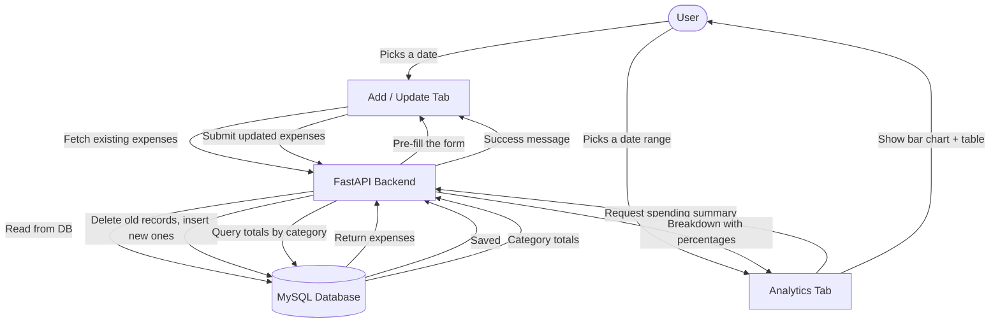

# Expense Management System

A full-stack web application for tracking, managing, and analyzing personal daily expenses. The system provides a clean browser-based interface to log expenses by date, categorize them, and view spending breakdowns over any custom date range. It is built on a decoupled architecture with a Streamlit frontend communicating with a FastAPI backend, backed by a MySQL relational database.

---

## Table of Contents

1. [Overview](#overview)
2. [Application Workflow](#application-workflow)
3. [Tech Stack](#tech-stack)
4. [Project Structure](#project-structure)
5. [Module Descriptions](#module-descriptions)
   - [Backend](#backend)
   - [Frontend](#frontend)
   - [Database](#database)
   - [Tests](#tests)
6. [Database Schema](#database-schema)
7. [API Reference](#api-reference)
8. [Setup and Installation](#setup-and-installation)
9. [Running the Application](#running-the-application)
10. [Running Tests](#running-tests)
11. [Logging](#logging)

---

## Overview

The Expense Management System allows users to:

- Select any date and record up to five expense entries, each with an amount, a category, and an optional note.
- Load and modify previously entered expenses for any date, since the system replaces the full set of entries for a given date on each save.
- Switch to an analytics view and select a start and end date to retrieve a category-wise spending summary, including totals and percentage breakdowns, rendered as both a bar chart and a sortable table.

The frontend and backend are fully separated. The frontend communicates with the backend exclusively through HTTP requests to the REST API. This design makes each layer independently replaceable and testable.

---

## Application Workflow



---

## Tech Stack

| Layer        | Technology                                      | Version       |
|--------------|-------------------------------------------------|---------------|
| Frontend     | Streamlit                                       | 1.35.0        |
| Backend      | FastAPI                                         | 0.112.2       |
| Data Models  | Pydantic                                        | 1.10.9        |
| ASGI Server  | Uvicorn                                         | 0.30.6        |
| Database     | MySQL                                           | 8.0+          |
| DB Connector | mysql-connector-python                          | 8.0.33        |
| Data Handling| Pandas                                          | 2.0.2         |
| HTTP Client  | Requests                                        | 2.31.0        |
| Testing      | Pytest                                          | 8.3.2         |

---

## Project Structure

```
Expense-Management-System/
├── README.md                        # Project documentation
├── requirements.txt                 # Python package dependencies
│
├── backend/
│   ├── server.py                    # FastAPI application and route definitions
│   ├── db_helper.py                 # All database query and mutation functions
│   └── logging_setup.py             # Centralized logging configuration
│
├── database/
│   └── expense_db_creation.sql      # SQL script to create the database, table, and seed data
│
├── frontend/
│   ├── app.py                       # Streamlit entry point and tab layout
│   ├── add_update_ui.py             # UI logic for the Add/Update expenses tab
│   └── analytics_ui.py             # UI logic for the Analytics tab
│
└── tests/
    ├── conftest.py                  # Pytest configuration and sys.path setup
    └── backend/
        └── test_db_helper.py        # Unit tests for the database helper functions
```

---

## Module Descriptions

### Backend

#### `backend/server.py`

This is the FastAPI application file. It defines the HTTP API that the frontend consumes. It imports and delegates all data access to `db_helper.py`.

**Pydantic Models:**

- `Expense` — Represents a single expense entry with three fields: `amount` (float), `category` (string), and `notes` (string).
- `DateRange` — Represents a date range with `start_date` and `end_date`, both typed as Python `date` objects and automatically validated by Pydantic.

**Routes:**

- `GET /expenses/{expense_date}` — Accepts a date in `YYYY-MM-DD` format as a path parameter and returns a list of all expense records stored for that date. Returns HTTP 500 if the database call fails.
- `POST /expenses/{expense_date}` — Accepts a date as a path parameter and a JSON array of `Expense` objects in the request body. It deletes all existing expense entries for that date and inserts the new ones, effectively replacing the daily record. Returns a success message on completion.
- `POST /analytics/` — Accepts a `DateRange` JSON body. Queries the database for a category-grouped spending summary across the specified date range, calculates percentage contribution per category, and returns a dictionary keyed by category name.

---

#### `backend/db_helper.py`

This module encapsulates all direct interaction with the MySQL database. It uses a context manager (`get_db_cursor`) to safely open and close connections and cursors. All queries use parameterized statements to prevent SQL injection.

**Context Manager:**

- `get_db_cursor(commit=False)` — Opens a MySQL connection and yields a dictionary cursor. If `commit=True`, it commits the transaction before closing. This ensures that read operations never accidentally commit and that write operations are atomic.

**Functions:**

- `fetch_expenses_for_date(expense_date)` — Executes a `SELECT` query filtering by `expense_date` and returns all matching rows as a list of dictionaries.
- `delete_expenses_for_date(expense_date)` — Executes a `DELETE` query to remove all expense records for the given date. Called before re-inserting updated entries.
- `insert_expense(expense_date, amount, category, notes)` — Inserts a single expense row into the `expenses` table.
- `fetch_expense_summary(start_date, end_date)` — Executes a `SELECT category, SUM(amount) AS total` query grouped by category for records within the given date range. Returns one row per category.

---

#### `backend/logging_setup.py`

This module provides a reusable logger factory used across the backend.

- `setup_logger(name, log_file='server.log', level=logging.DEBUG)` — Creates and returns a named Python logger that writes formatted log entries to `server.log`. The format includes timestamp, logger name, log level, and message.

---

### Frontend

#### `frontend/app.py`

This is the Streamlit entry point. It sets the page title to "Expense Tracking System" and renders two tabs:

- **Add/Update** — Delegates to `add_update_tab()` in `add_update_ui.py`
- **Analytics** — Delegates to `analytics_tab()` in `analytics_ui.py`

---

#### `frontend/add_update_ui.py`

This module implements the Add/Update tab. Its behavior is as follows:

1. A date input widget appears at the top. When the user selects a date, a `GET` request is immediately sent to `/expenses/{selected_date}` to retrieve any previously saved entries for that day.
2. A three-column form is rendered with the headers Amount, Category, and Notes. It contains five rows of input fields, pre-populated with the fetched data where it exists.
3. The Category column uses a dropdown limited to five predefined options: Rent, Food, Shopping, Entertainment, and Other.
4. On form submission, all entries with an amount of zero are filtered out. The remaining entries are sent via a `POST` request to `/expenses/{selected_date}` as a JSON array.

---

#### `frontend/analytics_ui.py`

This module implements the Analytics tab. Its behavior is as follows:

1. Two date inputs are presented side by side — Start Date and End Date.
2. When the user clicks the "Get Analytics" button, a `POST` request is sent to `/analytics/` with the selected date range.
3. The returned JSON is parsed into a Pandas DataFrame with three columns: Category, Total, and Percentage.
4. The DataFrame is sorted in descending order by Percentage.
5. A bar chart is rendered showing the percentage contribution of each spending category.
6. Below the chart, a formatted table is displayed showing each category's total spend and percentage share.

---

### Database

#### `database/expense_db_creation.sql`

This SQL script initializes the entire database from scratch. It creates the `expense_manager` database, defines the `expenses` table, and inserts a comprehensive set of seed data spanning August and September 2024.

---

### Tests

#### `tests/conftest.py`

Inserts the project root directory into `sys.path` at runtime so that test files can import modules from the `backend/` package.

---

#### `tests/backend/test_db_helper.py`

Contains unit tests for the `db_helper` module operating against the live MySQL database.

- `test_fetch_expenses_for_date_aug_15` — Verifies a known record for August 15, 2024.
- `test_fetch_expenses_for_date_invalid_date` — Verifies that a far-future date returns an empty list.
- `test_fetch_expense_summary_invalid_range` — Verifies that a date range with no data returns an empty list.

---

## Database Schema

**Database name:** `expense_manager`

**Table:** `expenses`

| Column         | Type           | Constraints                    | Description                                 |
|----------------|----------------|--------------------------------|---------------------------------------------|
| `id`           | INT            | PRIMARY KEY, AUTO_INCREMENT    | Unique identifier for each expense record   |
| `expense_date` | DATE           | NOT NULL                       | The date the expense was incurred           |
| `amount`       | FLOAT          | NOT NULL                       | The monetary amount of the expense          |
| `category`     | VARCHAR(255)   | NOT NULL                       | Spending category (Rent, Food, etc.)        |
| `notes`        | TEXT           | Nullable                       | Optional description or note for the entry |

---

## API Reference

All endpoints are served by the FastAPI backend running at `http://localhost:8000` by default.

---

### GET `/expenses/{expense_date}`

Retrieves all expense entries recorded for a specific date.

**Path Parameter:**

| Parameter      | Type   | Format       | Description                   |
|----------------|--------|--------------|-------------------------------|
| `expense_date` | string | `YYYY-MM-DD` | The date to query expenses for |

**Response:** `200 OK`

```json
[
  {
    "amount": 1200.0,
    "category": "Rent",
    "notes": "Monthly rent payment"
  }
]
```

---

### POST `/expenses/{expense_date}`

Replaces all expense entries for a specific date with a new set of entries.

**Request Body:**

```json
[
  {
    "amount": 350.0,
    "category": "Rent",
    "notes": "Shared rent payment"
  }
]
```

**Response:** `200 OK`

```json
{
  "message": "Expenses updated successfully"
}
```

---

### POST `/analytics/`

Returns a category-wise spending breakdown for a specified date range.

**Request Body:**

```json
{
  "start_date": "2024-08-01",
  "end_date": "2024-08-31"
}
```

**Response:** `200 OK`

```json
{
  "Rent": {
    "total": 2427.0,
    "percentage": 45.23
  },
  "Food": {
    "total": 1060.0,
    "percentage": 19.75
  }
}
```

---

## Setup and Installation

### Prerequisites

- Python 3.9 or higher
- MySQL Server 8.0 or higher
- pip

### Step 1 — Clone the Repository

```bash
git clone https://github.com/GeekSomesh/Expense-Management-System.git
cd Expense-Management-System
```

### Step 2 — Install Python Dependencies

```bash
pip install -r requirements.txt
```

### Step 3 — Set Up the Database

Run the provided SQL script against your MySQL instance:

```bash
mysql -u root -p < database/expense_db_creation.sql
```

---

## Running the Application

The application requires two processes running simultaneously.

### Start the Backend Server

```bash
uvicorn backend.server:app --reload
```

The API will be available at `http://localhost:8000`. Interactive API docs are at `http://localhost:8000/docs`.

### Start the Frontend

```bash
streamlit run frontend/app.py
```

---

## Running Tests

```bash
pytest tests/
```

---

## Logging

The backend writes structured log entries to `server.log` in the working directory. Every database function call is logged with its input arguments, timestamp, and log level.

```
2024-08-15 10:23:01,452 - db_helper - DEBUG - fetch_expenses_for_date called with 2024-08-15
```
